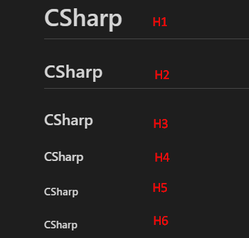
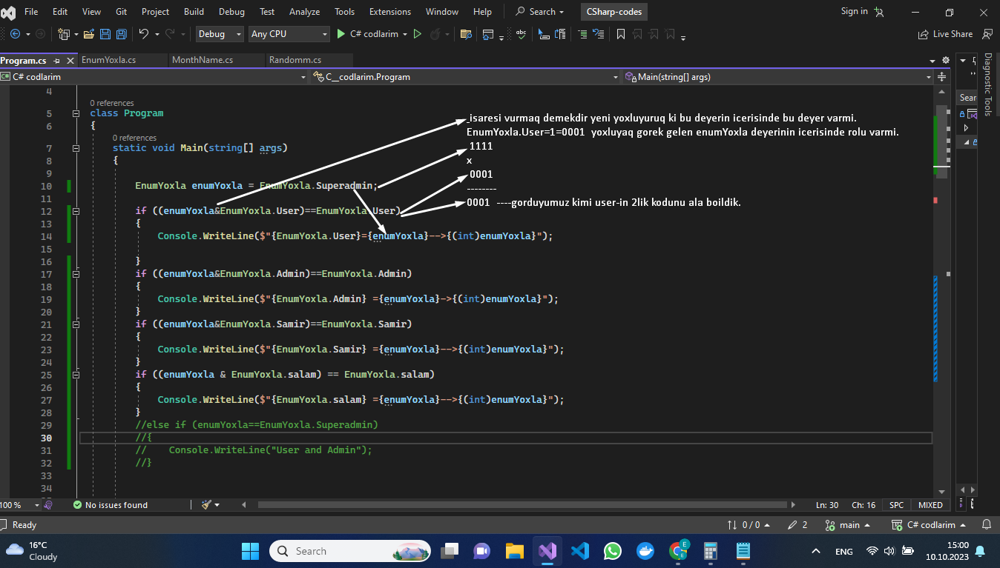
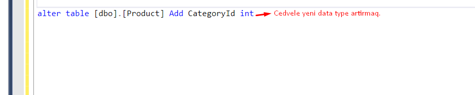

#  ***PROGRAMMİNG BOOK*** 
<b> **Proqramlaşdırma haqqında məlumat.** </b><br/>
> Proqramlaşdırma, müxtəlif tapşırıqları yerinə yetirmək üçün kompüterə əmr vermək və ya hər hansısa bir işi görmək üçün yaradılan alqoritmanın bir proqramlaşdırma dilində yazılaraq komputer tərəfindən emal edilməsidir.Bu əmrlər komputerə nəyin necə işləyəcəyini və ya nəyi necə işlədəcəyini bildirir. Programlaşdırma dilləri bir növ insan ilə komputer arasındakı dialoq vasitəsidir. Biz komputerə onun anladığı dildən əmrlər veririk, komputer də bizim əmrlərimizi nöqtə vergülünə qədər icra edir. Başqa təsvir, proqramlaşdırma bir problem həll etmə sənətidir.
__________________________________________________________________________________
<b> **Proqramlaşdırma dilləri.**</b><br/>
<br/>
__________________________________________________________________________________
<br/><br/>
 # Markdown Kodları
 <details><summary> <b> 1.Markdown Kodu </b></summary><br/>
- [X] Code
- [ ] Review
- [ ] Commit
<br/>
> 
* H1 yazmaq üçün kod  (# CSharp) 
* H2 yazmaq üçün kod  (## CSharp)
* H3 yazmaq üçün kod  (### CSharp)
* H4 yazmaq üçün kod  (#### CSharp)
* H5 yazmaq üçün kod  (##### CSharp)
* H6 yazmaq üçün kod  (###### CSharp)


# CSharp
<!-- ## H2 -->
## CSharp
<!-- ### H3 -->
### CSharp
<!-- #### H4 -->
#### CSharp
<!-- ##### H5 -->
##### CSharp
<!-- ###### H6 -->
###### CSharp


**Qalın yazmaq üçün !** <br/>
__Qalın yazmaq üçün !__ <br/>
*İtaliq yazmaq üçün !* <br/>
_İtaliq yazmaq üçün !_ <br/>
~~Üzərindən xətt çəkmək üçündür !~~ <br/>

> Mətin yazmaq üçündür !

[Linke kecid  etmek ucun](https://www.google.com)


1. A
    1. F
    2. F
2. B
3. D


* A
     * AA
     * BB
* B
* C

```CSharp 
            Console.WriteLine("Hello, World!");
            Console.ReadLine();
```
________________________________________________________________________________________
</details>

<br/><br/>
# H1

<details><summary><b>1.C-Sharp</b></summary><br/>
<details><summary><b>1.Movzu:Bezi axdarislar..</b></summary><br/>
<a href="https://stackoverflow.com/questions/449887/sending-e-mail-using-c-sharp">1.C# E-mail gondermek yolu !</a><br>
<a href="https://survey.stackoverflow.co/2022/#technology">2.Burada proqram dillerinin ilden ile inkisafina baxa bilerik !</a><br>
<a href="https://app.diagrams.net/#G1mSYKv9CSSXe6tr4bshxjfb5QuU_hI0kP">3.Alqoritim qurmaq ucun isdifade edilen sexemleri bize verir !</a><br>
<a href="https://learn.microsoft.com/en-us/dotnet/csharp/language-reference/keywords/">4.C# da acar sozlere baxmaq !</a><br>
<a href="http://www.java2s.com/Tutorial/CSharp/CatalogCSharp.htm">5.C# ders sayiti !</a><br>
<a href="http://extraconversion.com/base-number">6.Say sisteminin cevrilisi!</a>


</details>


<b>________________________________________________________________________________________________________________</b>

<details><summary><b>2.Movzu:Cmd ---- emirleri.</b></summary><br/>
1.<b>cd bosluq enter</b> oldugun fayila aparir.<br/> 2.<b>cd bosluq ..</b> bir fayil geri cixir.<br/> 3.<b>cd bosluq fayilin adi</b> adi qeyd edilen fayila kecit edir.<br/> 4.<b>cls</b>acilmis butun melumatlari temizleyir.<br/> 5.<b>dir</b> fayilin icine daxil olur.<br/> 6.<b>mkdir</b> yeni fayil yaradir.<br/> 7.<b>prompt $$</b> yeni setri dollar isaresi ile basladir.<br/> 8.<b>dotnet run</b> emri ise kodu ise salir.<br/> 9.<b>code .</b> visual studio coda kecid emridir.<br/> 10.<b>echo "" >>.gitignore</b> -- burada yeni cmd ekraninda .gitignore fayili yarada bilerik bu emirle.<br/> 11.<b>rundll32.exe user32.dll,LockWorkStation</b> komputeri cmd ile kilidlemek ucun olan emir.<br/>
<b><i>(Solutions and project)</i></b><br/>
QEYD. Cmd --qara ekrandan istifade ederek biz yeni solutions ve preject yarada bilerik.Bunun ucun bir nece etablari kecmeliyik.Evvelce yeni fayil yaratmaliyiq. Fayili ise mkdir emri ile yarada bilerik bunu yuxarida qeyd etmisem . Yeni Solutions ve project yaradaq..

1.  ci mkdir emri ile fayil yaradiriq.
2.  ci dotnet new sln --name (solutions adi meselen: code)
3.  cu project yaratmaq ucun--> dotnet new console --framework net6.0 --use-program-main emrinden istifade edirik .Burada isdesek net6.0 fersiyani istesek deyise bilerik.
4.  cu ise solutions ve projecti elaqelendiririk-->> dotnet sln (solution adi yeni:code) add 5.project\csproj sonlugu ile biten fayil ve enter.<br/>

<a href="https://learn.microsoft.com/en-us/dotnet/core/tools/dotnet-sln"><b>Axdaris yerine dotnet new sln --name MySolution</b>-yazdiqda asagidaki sekili tapmaq lazimdir.</a><br/>
<i>Sayita daxil olduqdan sonra bu (dotnet new sln --name MySolution) yazilisi tapib isdifade ede bilerik. </i><br/>

<p>

</p><br/>
<p> Axdaris yerine dotnet create new console app project yazzsaq yeni project yaratmaq ucun asagidaki sekil gelecekdir.

</p><br/> 14.<i> Yaratdigimiz solutions ve projecs elaqelendirmek ucun google axdarisa (dotnet add project solutions create) sayita daxil olduqdan sonra ise qarsimiza cixan (dotnet sln solution.sln add --solution-folder foo1\foo2\foo3 bar.csproj) yazilisdan istifade ederek elaqeni yaradiriq.</i><br/>
<p>

</p><br/>
</details>
<b>________________________________________________________________________________________________________________</b>

<details><summary><b>3.Movzu:GITHUB ---->> Yaratmaq.</b></summary><br/>
    QEYD. Github yaratmaq ucun profile daxil olub qeydiyatdan kecirik, daha sonra ise bir nece emirden isdifade ederek yeni repositories yarada bilerik .
    …or create a new repository on the command line

1.  git clone (linkimizi buraya yerlesdiririk).<br/>
2.  echo "dirnaq arasina ne isdesez yaza bilersiz">> README.md -------->>(readme fayili yaratmaq ucundur.)<br/>
3.  git init ---------->>>(git pafqasi yaratmaq ucundur )<br/>
4.  git add README.md ------->>(readmi fayilini testiq etmek ucun)<br/>
5.  git commit -m "first commit" -----(deyisikliye ad vermek ucun)<br/>
6.  git branch -M main<br/>
7.  git remote add origin https://github.com/xasiyevRandom method./taskkkk.git<br/>
8.  git push -u origin main<br/>
9.  Eger Github-a ilk defe qosuluruqsa onda asgidaki emirleri etmeliyik ardicilliqla.<br/>
<b>a.git</b> config --global user.name "xasiyevsamir"<br/>
<b>b.git</b> config --global user.email "qeydiyyatdan kecdiyimiz email."<br/>
<b>c.git</b> config --global user.password "qeydiyyatdan kecdikde yaratdigimiz password."<br/>
<b>d.git</b> config user.name "xasiyevsamir"<br/>
<b>e.git</b> config user.email "qeydiyyatdan kecdiyimiz email."<br/>
<b>f.git</b> config user.password "qeydiyyatdan kecdikde yaratdigimiz password."<br/>
Bu emirlerden istifade etmekle yeni repositories yarada bilerik!!!
</details>
<b>________________________________________________________________________________________________________________</b>

<details><summary><b>4.Movzu:Math sinifi.</b></summary><br/><br/>

1.<b>(Math.Pow(10,2))</b> ---> burada 10 kvadratini yazmisiq yeni (10\*10) .Bunu isdediyimiz kimi yaza bilerik yeni kub ve s. Meselen: Math.Pow(10,3) , (10,4).<br/> 2.<b>(Math.Log10)</b>---> ededin nece reqemli oldugunu tapir amma neticenin usdune mutleq 1 gelirik.<br/> 3.<b>(Math.sqrt)</b>----> koku tapmaq ucun istifada edilir.<br/> 4.<b>(Math.Round)</b>---> riyazi yuvarlasdirmaq ucun istifade edilir.<br/> 5.<b>(Math.Floor)</b>---> asagi yuvarlasdirmaq,yeni tam hisseye kimi atir.<br/> 6.<b>(Math.Ceiling)</b>---> yuxari yuvarlasdirmaq.<br/> 7.<b>(Math.PI)</b>---> pi deyeridir .hesabliyada isdifade ede bilerik.<br/> 8.<b>(Math.Abs)</b>--->Modulu tapmaq ucundur.<br/> 9.<b>(Math.Max)</b>--> ededin maksimumun tapir.<br/> 10.<b>(Math.Min)</b>--> ededin minumumun tapir.<br/>

</details>
<b>________________________________________________________________________________________________________________</b>

<details><summary><b>5.Movzu:Vareybillar ve Tiplerin bir-birine cevrilmesi.</b></summary>
23. Vareybillar bizim kod yazarken adlandirdigimiz hissedir ,yeni aldigimiz melumati, deyeri neyin daxilinde saxliyiriqsa bunlara vareybillar deyilir.Mes : int a =10; char='A'; string b="cofe", double c=12.3;
burada a,b, ve c vareybil adlanir.Vareybillari biz teyin edirik. Burada 10, 12.3, "cofe" ise data adlanir yeni melumat.Burada int, string ve double ise bizim datatype adlanir.Yeni datatype datanin hansi tipdan oldugunu bildirir, fincanda cofe dedikde burda cofe data b vareybil string ise datatype-dir.Yeni fincanin hansi materialdan oldugunu bildirir yeni saxsi ve ya suse.
<b>DataType-larin Novleri .</b>DataType 2 novu var <b>(Value ve Refarence)</b><br/><details><summary><b>Value</b></summary>Reqem tipli datalari saxlamaq ucundur Mes:<b>int,double,char,float,byte</b><br/><b>Reqem Tiplerin Cevrilmesi.</b> Bunun 2 izahi var.<br/> <b>1.Implicit ot auto conversion.</b><br/><i>Sekilde gorduyumuz kimi az tutumlu datatype cox tutumlu datatype uzerine atriq yeni onsuzda short ve int byte uzerine gotre bilir ve buna gorede bu cevirmeye avtomatic implicit deyilir.Yeni avtomatiq olaraq cevrir problemsiz.</i>
<a href="https://learn.microsoft.com/en-us/dotnet/csharp/language-reference/builtin-types/integral-numeric-types">1.Reqem tiplere bax.</a><br/>
<a href="http://www.unitconversion.org/numbers/base-10-to-base-2-conversion.html">2.Say sistemlerine cevirmeler.</a><br/>
<p>
 
 </p><br/>
 <b>2.Explicit conversion.</b><br/>
 <i>Sekilden gorduyumuz kimi int tipinden olan bir datani ondan kicik tipe int-e cevirmek isdemisik ve biz cevirerken (short) yazmaqla demisik ki problem yoxdu int tipinde olan datani short tipi qebul ede bilecek ve qebul ede bilmese mesuliyyeti uzerime gotrurem .Eger short gotre bilmerse hemin tipi dovur edir ve ozu gotre bileceyi datada dayanir.Eger biz problem oldugu halda bize melum olmagini isdesek <b>checked</b>-ile biz bu erroru gore bilerik.</i>
 <p>
 
 
</p>
<i><b>dec>long>doub>int>short>byte</b>.Reqem tipli datatiplerin tutumuna gore muqayisesi.</i>
<p>
<i>Reqem tipleri asagidakilardir.</i>
 
</p>
 </details>
<details><summary><b>Refarence</b></summary><br/>Metin tipli datalari saxlamaq ucundur Mes:<b>string, class,Method,Massiv ve s.</b><br/>
<b><i>1.Convert.ToInt32</i></b>----> <i>Butun tiplerden cevirme apara bilir Parse dan ferqli olaraq.</i><br/>
<b><i>2.Tipin adi.Parse</i></b> ----> </i>Yalniz reqem tipli stringleri cevire bilir. mes: "123". Yeni string olmayan neyise cevire bilmir</i>.<br/>
<b><i>3.Tipin adi.TryParse(date, out Tipin adi a)</b></i>---> <i>bu cevirme digerlerinden ferqlenir yeni geriye bool (ture,false) qaytarir yeni cevrile bilir ya cevrile bilmir .</i></details>
</details>
<b>________________________________________________________________________________________________________________</b>

<details><summary><b>6.Movzu: Operatorlar.</b></summary>
Operatorlar bir nece yere ayrilirlar bunlar asagidakilardir.
<p>
 
 </p><br/>

 <details><summary><p><b>Sade operatorlar--></b>
 
 </p></summary>
 <p>
 
 </p>
<p>
 
 __Toplama emeliyyatini yerine yetirmek ucundur.<b> int number=number1+number2</b><br/>
 
 __Cixma emeliyyatini yerine yetirmek ucundur.<b> int number=number1-number2</b><br/>
 
 __Vurma emeliyyatini yerine yetirmek ucundur.<b> int number=number1*number2</b><br/>
 
 __Bolme emeliyyatini yerine yetirmek ucundur.<b> int number=number1/number2</b><br/>
 
 __Qaliq alma emeliyyatini yerine yetirmek ucundur.<b> int number=number1%number2</b><br/>
 
 __Bir artirma emeliyyatini yerine yetirmek ucundur.<b> int number=5; number++;</b><br/>
 
 __Bir azaltma emeliyyatini yerine yetirmek ucundur.<b> int number=5; number--;</b><br/>
 </p></details>
 <details><summary><p><b> Mentiqsel operatorlar--></b>
 
 </p></summary>
 
 __Beraberdir sertini yoxlamaq ucun operatordur ve geriye <b><i>true, false</i></b> qaytarir.<b></b><br/>
 <br/>
 
 __ Ferqli Beraberdir sertini yoxlamaq ucun operatordur ve geriye <b><i>true, false</i></b> qaytarir.<b></b><br/>
 <br/>
 
 __ Boyuk ve ya Kicik olub olmadigini yoxlamaq ucun operatordur ve geriye <b><i>true, false</i></b> qaytarir.<br/>
 <br/>
 
 __ Boyuk beraberdir ve ya Kicik beraberdir olub olmadigini yoxlamaq ucun operatordur ve geriye <b><i>true, false</i></b> qaytarir.<br/>
 <br/>
 <p>
 </details>
<details><summary><p><b>Serti operatorlar--></b>
 
 </p></summary>
 <p>
 
 __ Ve operatoru butun sertlerin dogru olub olmadigini yoxlamaq ucun operatordur ve geriye <b><i>true, false</i></b> qaytarir. Butun sertler mutleq dogru olmalidir.Qeyd edek ki VE operatoru butun sertlerin her birini yoxlayir ki belke sonuncu sert false oldu diye.<br/>
 <br/>
 
 __ Ve ya operatoru sertlerin hec olmasa biri dogru olub olmadigini yoxlamaq ucun operatordur ve geriye <b><i>true, false</i></b> qaytarir.Sertlererin hec olmasa biri mutleq dogru olmalidir.Qeyd edek kiVE YA operatoru evvelki sertlerde true gorse diger sertleri yoxlamir cunki VE YA operatorununa bir ture serti de qanedir.<br/>
 <br/>
 
 __ Inkar operatoru eger sertde <i>ture</i> gelse onu <i>false</i>, <i>false</i> gelse ise <i>true </i>edecekdir.<br/>
 <br/>
 </p></details>
 <details><summary><p><b>BitWise operatorlar--></b>
 
 </p></summary>
 <p>
 <b>Hazirlanmayib.</b>
 </p>
 <p></details>
<details><summary><p><b>Teyin operatorlar--></b>
 
 </p></summary>
 <p>
 
 __ Bu operatoru qisa yazilisda isdifade edirik .Sekilde baxa bilersiz.<br/>
 <br/>
 
 __ Bu operatoru qisa yazilisda isdifade edirik .Sekilde baxa bilersiz.<br/>
 
 <h1>Eyni ile vurma bolme eynidir.</h1>
 </p>
</details>
<details><summary><p><b>Muxdelif emeliyyat operatorlar--></b>
 
 </p></summary>
<i><b>Sizeof(int)-</b>DateType nece byte yer tutdugunu bildirir.</i><br/>
 
 <br/>
 <i><b>typeof(int)-</b>Datanin tayipini yoxlamaq ucundur.</i><br/>
 
 <br/>
 <i><b>?-null operatoru</b>-Reqem tipli datalar hec vaxd null ola bilmez ama biz mecbur ede bilerik ki o null olsun ve olanda serte girsin.</i><br/>
 
 </p></summary>
</details></details>
<b>________________________________________________________________________________________________________________</b>

<details><summary><b>7.Movzu:Console codlari.</b></summary>
1.<b>Console.Write();</b> ---> bu kod vasitesi ile biz ekranda her hansi bir melumati cap(yazdira) ede bilerik.Yazini cap edir ve nobeti yazini cap etdirende qarsisina alir yeni Console.Write("Random method.")
Console.Write("xasiyev") netice---> Random method.xasiyev olacaqdir. oldugu setirde qalir.<br/> 2.<b>Console.WriteLine();</b> ---> bu yuxaridaki emirle eynidir lakin bu emirde eyni setirde deyil novbeti setire kecid olunur.<b>Netice----> Random method. </b> --->> xasiyev olacaqdir.<br/> 5.<b>Console.Redkey();</b> yazilmis her hansi melumati oxumaq ucun ekranda gozluyer bir melumat daxil etdikde ise baglanar.<br/> 6.<b>var key=Console.ReadKey(), (key.Key==ConsoleKey.Enter)</b>bu yazilisla biz isdifadecinin hasi duymeni sabasini izah ede bilerik.<br/> 7.<b>Console.ReadLine();</b> istifadeciden melumat almaq ucun ekranda gozluyer melumati daxil edib enteri basdiqada melumati bize getrir.<br/> 8.<b>Console.CursorTop()</b> bu method ise kursorun hal hazirki durdugu yeri gosderir.<br/> 9.<b>Console.SetCursorPosition(0,Console.CursorTop)</b> bu method ile cursoru harda durmagindan asli olmayaraq hemin setrin ilk baslangicina getrir.burada sifir o demekdirki hemin setr olsun Console.CursorTop ise hemin setirde kursorun hal hazirki durdugu yer.<br/> 10.<b>Console.WindowWidth</b> bu ise console ekrani boyunca demekdir.<br/>
</details>
<b>________________________________________________________________________________________________________________</b>

<details><summary><b>8.Movzu:Datatype</b></summary>
<b>Datatype 4 yere ayrilir .<i>(Metin, reqem, mentiqi, zaman......).....</i><a href="https://www.w3schools.com/cs/cs_data_types.php">Data type baxin --></a><br/></b><br/>
<details><summary><b>Metin tipli Datatipe.</b></summary>
1.<b>string</b> --> Her hansi bir metin tipli melumatlari saxlamaq ucun istifade edilir.Mes: <b>string name ="Random method.", "Random method. 123","1234".</b> stringin uzunlugu <b>name.Lenght</b> propertisi ile tapilir, bu zaman bosluqlarda sayilir.mes: <i>"Random method. 123" de uzunluq</i><b> 9 dur.</b><br/>
 
</details>.

<b></b><br/> 2.<b>(Char)</b> --> bu tipde string tipi kimi eynidir lakin bir metin yeni A,B daxil etdikde istifade edrik eyni zamanda string de istifade etmek dogrudur .<b>string ve char methodlari</b><br/> -<b>(Join())</b> (qosmaq,birlesdirmek menasini verir) bu method ile metinleri bir birine isdediyimiz sekilde birlesdire bilerik. Mes: <b>string name1=string.Join("*",name)</b> -->Netice:Random method.*Random method. 123*1234 string[] ve char[] massivine ayitdir.<br/> -<b>(ToCharArray())</b> bu method ile stringde olan metni herif herif Char[] masivine yazdira bilerik.<br/> -<b>(Array.Reverse())</b> bu method masivlerin sonuncu ideksinden baslar sifirinci idekse atar sora axirdan 2ci ideksi birinci indekse atar ve s.<br/> -<b>(Data.PadLeft(6,'0'))</b> bu method sola isdenilen simvolu ve ya bolsulugu atmaq ucundur.Burda sola 6 sifir atdiq.<br/> -<b>(Data.PadRight(6,'0'))</b> bu method saga isdelinen simvolu ve ya boslugu atmaq ucundur.Burda saga 6 sifir atdiq.<br/> -<b>(Data.ToUpper())</b> bu method gelen ve ya elimizde olan datani hamisini boyuk heriflere cevirir.<br/> -<b>(Data.ToLower())</b> bu method gelen ve ya elimizde olan datanin hamisini kicik herife cevirir.<br/> -<b>(Data.Substring(0,4))</b> bu method datada necenci indeksden deyrikse ordan basliyir ve nece element gotur deyirikse o qederini gotrur, mes:burda 0-ci indeksden basliyir ve 4 element gotrur.<br/> -<b>(Data.IndexOf)</b>(indeks menasina gelir)--> bu method ise massiv ve ya kolleksionun daxilinde her hansi data var sa onun indeksini geri int olaraq donur.mes:<b>(int indeks= A1.IndexOf("Random method.");)</b> sozu varsa gedib onun indeksini tapib getrir.Amma qeyd edek ki bu method qarsisina cixan birinci elementin indeksini gotrur ve emeliyyati bitrir ,yeni orda bir nece Random method. sozu olsa ilk qarsisina cixani goturecekdi. Qeyd: edeki eger axdardigimiz soz orada yoxdursa int olaraq geri donus <b>-1</b> olacaqdir .Cunki sifir ozu mumkun indeksdir.<br/> -<b>(Data.Replace("Random method.","valeh"))</b> bu method ise metinde olan isdenilen datani basqa data ile deyismeye imkan verir.Burada Random method. sozunu metinden cixarib valeh sozunu elave etdik.<br/> -<b>(Data.Trim())</b> bu method sonda ve evvelde ki bosluqlari ve ya <b>Data.Trim('*')</b> sonu ve evelindeki ulduz ve ya diger simvollar olarsa olarida silecek.<br/> -<b>(Data.TrimStart())</b> bu methodda trimden toreyib ve ondan ferqli olaraq datanin evvelindeki boslugu ve ya simvolu silir.<br/> -<b>(Data.TrimEnd())</b> bu methodda trimden toreyib ve ondan ferqli olaraq datanin sonundaki boslugu ve ya simvollari silir.<br/> -<b>(Data.LastIndexOf())</b> IndexOf ile eyni isi gorur sadece axdarisa sondan baslayir ve ilk dogru melumati tapan kimi onun indeksini int olaraq geri donur ve emeliyyatii bitirir.Qeyd: LastIndexOf sondan basliyaraq yoxlayir ve ilk uygun datanin ik elementinin indeksini geri qaytarir mes:(Random method.) axdarsaq s- herifinin indeksini bize geri donus edecek.<br/> -<b>(Data.Insert(1,"salam"))</b> bu method ile isdenilen indekse isdediyimiz datani elave ede bilerik.burada 1ci indekse salam sozunu elave etdik.<br/> -<b>(Data.Remove(1,2))</b> bu method ile isdenilen indeksden baslayib sile bilerik eyni zamanda silme araliginida biz veririk meselen biz burda 1 ci indeksden basla 2 element sil demisik.<br/> -<b>string s=new string('\*',3)</b> --> bu o demekdir ki 3 dene <b>\*\*\*</b> yazdiracaq.Amma method deyil string obyektidir.<br/> 4.<b>StringBuilder sb = new StringBuilder();</b> bu da bir sinifdir ve metinlerle isleyir ve string tiplerinden daha cox suretlidi kolleksiondur demek olar ki. ve onun metodlari asagidakilardir.<br/>

-<br>sb.Append("Random method.")</b> bu methodun komeyi ile datani stringbuilder e elave etmek olar.Bu methodun 25 overladi var ve demek olarki butun tipleri stringbuilder e elave etmek olur.<br/> -<b>sb.AppendLine()</b> bu method ise datani elave edir ve novbeti datani bir asagi setre elave edir.BU methodun 3 overladi var yeni bezi tipleri stringe cevrib gondermeliyik.<br/> -<b>sb.AppendFormat("{0}{1}",2,3)</b> bu method ile stringleri datalara uygun yaza bilerik.Burada 0 ci indekse 2 1ci indekse ise 3 atdi.<br/> -<b>sb.AppendJoin()</b> bu method ise stringlerde oldugu kimi burdada datalari bir birine isdediyimiz kimi birlesdirir.<br/> -<b>sb.Clear()</b> bu method ile datani sile bilerik.<br/> -<b>sb.Length</b> bu ise method deyil sadece uzunlugunu tapa bilerik stringbuildin.<br/> -<b>sb.Capacity</b> bu da method deyil sadece ayirdigi yerdir .<br/>

5.<b>(object)</b> bu tip uzerine butun tipleri ala bilir yeni inti, double, string ve s.Lakin uzerine aldigi tipi o tip kimi de cixarmalidir. int a=10; object b=a;(qutulama boxing) int c=(int)b;(qutudan cixartma unboxing). bunlari intin dauble kecidi ve double
inte kecidi ile qarisdirmaq olma . Cox oxsasada coxda ferqlidirler. object tipin eslinde xaricden nese gelerse saxlanilmasi uc isdifade oluna biler. Cunki biz xaricden hansi tipin geleceyini bilmirik .<br/> 6.<b>(var)</b>---> Var sagina baxaraq datanin hansi tipden oldugunu anliyir. var tip deyil .<br/> 7.<b>(dynamic)</b> tipdir ve onun icindeki datalara baxa ve uzerinde emeliyat apara bilerik.sadece sehv nese daxil etdikde error bizden gizledir.<br/> 8.<b>(as)</b> bu kivord obyekte geden tipin hansi tip oldugunu bilmek ucun ve as kivordu geriye null qaytarir. Null ola bileceyini demek isdiyirikse ? isaresinden istifade edirik mes: byte? a=b as byte?.<br/> 9.<b>(is)</b> bu kivord de eyni ile as benzeyir yeni opject den gelen bayitdirmi int c =10; object v=c; (v is byte) ve ya (v is int)<br/>

<p></p>
</details>
<b>________________________________________________________________________________________________________________</b>
<details><summary><b>9.Const--Deyismez.</b></summary>
<b>Const</b>--<i>Staticdir ve deyisdirile bilmez ilk olaraq hansi deyeri aldisa o deyeride saxlayacaqdir.</i><br/>
<p></p><br/><br/>
<b>readonly</b>--<i>Static deyil ve ilk yaradilan anda deyer ala biler ve ya conustructor methodun terkibinde deyer ala biler basqa hec yerde deyer ala bilmez.</i><br/>
<p></p>
</details><b>________________________________________________________________________________________________________________</b>
<details>
<summary><b>10.Bəzi açar sozlər.</b></summary>
<p>
<br/><br/>
<br/><br/>


</p>
</details>
<b>________________________________________________________________________________________________________________</b>
<details><summary><b>11.Massivler.</b></summary>
 <i>
 <b>(int[] number=new int[3])</b> --> burada biz int vassivi yaratdiq .Massivler muxdelif tiplerden ola biler.Burada int[3] 3 reqemi masivvin nece elementli olmasini yeni nece int tipinden data saxlamasini gosderir.Burada 3 indeksli yeni 3 data saxlanilir.Lakin komputer sayarken 0 dan saymaga baslayir.Yeni (0,1,2) burda saysaq 3 data saxlamaq olar yeni 0 ci indeksde bir data ve digerlerinde eynisi.Massivlerin mehtodlari var ve biz bu methodlari istifade etmek ucun <b>Array.</b> klasindan isdifade edirik .Yeni massiv ucun hansi methodu cagirsaq Array. deyirik.BU methodlar asagidakilardir.
 </i>
<p></p>
<a href="https://learn.microsoft.com/en-us/dotnet/csharp/programming-guide/arrays/multidimensional-arrays">1.Cox olculu massiv !</a><br/>
<b>Iki olculu massiv</b>.<i>Yuxaridaki sekildeki massiv 1 olculu massivdir 2 olculu massiv ise asagidakidir.</i><br/>
<p></p>
<b>(int[] number=new int[3])</b> --> burada biz int vassivi yaratdiq .Massivler muxdelif tiplerden ola biler.Burada int[3] 3 reqemi masivvin nece elementli olmasini yeni nece int tipinden data saxlamasini gosderir.<br/>Burada 3 indeksli yeni 3 data saxlanilir.Lakin komputer sayarken 0 dan saymaga baslayir.Yeni (0,1,2) burda saysaq 3 data saxlamaq olar yeni 0 ci indeksde bir data ve digerlerinde eynisi.<br/>Massivlerin mehtodlari var ve biz bu methodlari istifade etmek ucun <b>Array)</b> klasindan isdifade edirik .Yeni massiv ucun hansi methodu cagirsaq Array. deyirik.BU methodlar asagidakilardir.<br/>
<b>1.Array.Resize(ref massiv, a))</b> bu method ile biz masssivin nece elementli oldugunu bilmediyimiz halda isdifade ederek her defe massivin uzunlugunu artira bilerik ve ref massiv ve int a datalarini qebul edir.<br/>
<b>2.Array.IndexOf()</b>(indeks menasina gelir)--> mena olaraq eyni isi gorur ferqi odur ki massivlerde <b>Array.)</b> diye cagrilir stringlerde ise <b>data.)</b> cagrilir.<br/>
<b>3.Array.Reverse()</b> bu method masivlerin sonuncu ideksinden baslar sifirinci idekse atar sora axirdan 2ci ideksi birinci indekse atar ve s. mena olaraq eyni isi gorur ferqi odur ki massivlerde <b>Array.)</b> diye cagrilir stringlerde ise <b>data.)</b> cagrilir.<br/>
<b>4.Sort()</b>(menasi A-Z e duzmek,siralamaqdir)-> A-Z e siraliyir metinleri ve reqemleri ise kicikden boyuye. mena olaraq eyni isi gorur ferqi odur ki massivlerde <b>4.Array.</b> diye cagrilir stringlerde ise <b>data.)</b> cagrilir.<br/>
<b>5.Array.Clear())</b> bu method ile massivin butun indekslerindeki elementleri hamisini sifir edir.<br/>
<b>6.Array.Exists(array, a => a == 10); int[] array = { 1, 5, 3, 4, 5, 4, 7, 8, 11, 10, 11, },)</b> bu method ise massivin icinde bize lazim olan eded var yoxsa yoxdur diye bize cavab verir ve geri donus ture ve false doner. Burada => boyukdur lamda isaresi adlanir ve yoxluyur ve cavab qaytarir , gorunduyu kimi biz burada massivde 10 reqemin olub olmamisini yoxlamisiq ve bize ture cavabini donecekdir.<br/>
<b>7.Array.FindAll(array, a => a == 5))</b> bu method da Array.Exists ile eyni isi gorur yeni axdardigimizi tapir ferqli olaraq ture,false deyil tapdigi datanin ozunu geri doner.<br/>
<b>8.Array.Copy(array,Newarray , 2, 5))</b> bu method ile bir massivdeki datani diger massive kopyaliya bilerik ve bunun ucun hansi massivden gotureceyikse onu qeyd edirik yeni massiv hansi olacaqsa onu qeyd edirik ve necenci indeksden baslasin kopyalamaga onu ve sonda nece element kopyalanacaq onu qeyd edirik.<br/>
</details>
<b>________________________________________________________________________________________________________________</b>
<details><summary><b>12. If ,else if , else, switch.</b></summary>
<i>Serti skopkalar--Bir nece sertin eyni anda yoxlanmasini isdeyirikse bir nece <b>if</b> yazmaliyiq ki butun sertlere daxil olsun eks halda ise bir <b>if</b> ve bir nece <b> else if</b> yazmaliyiq bu halda yalniz dogru serte daxil olacaq yeni butun sertleri bir bir yoxlamiyacaq . <b>else</b> ise ifin eksini bildirir. If olmadan else if ve ya else yazmaq olmaz.<b>if</b> -den sonra bir nece if ve ya else if yaza bilerik.</i><br/>
<p></p>
<i>switch skopqasi</i>
<p></p>
<p></p>

</details>
<b>________________________________________________________________________________________________________________</b>
<details><summary><b>13.Loops-Dovurler.</b></summary>
<i>Dovurlerin bir nece novleri var bunlara misal olaraq asagidakilari gosdere bilerik.
</i>
<ul type="square">
  <li><b>for loop;</b></li>
  <li><b>while loop;</b></li>
  <li><b>do while loop;</b></li>
  <li><b>foreach loop;</b></li>
</ul>
<i><b>for loop</b>.Asagidaki sekilde sertin yerine yeni for ne qeder dovur etmelidir yerine <b>true</b> yazdiqda sonsuz dovre dusecek.
</i><br/>
<p></p>
<i><b>break-(qirmaq) ve contiune-(davam etmek)</b>.Acar sozlerdir ve dovur olduqda dovru isdediyimiz zaman qira ve ya davam etdire bilerik.Bu acar sozleri butun loop-larda isdifade ede bilerik.</i>
<p></p>
<i><b>while loop</b>. While dovru true,false qebul edir yeni ture oldugu muddetce dovur davam edecekdir.Ne zaman dovur false olarsa o zaman dovur bitecekdir.</i><br/>
<p></p>
<i><b>do While loop</b>. Bu loop da While loop ile eynidir yalniz bir ferqi odur ki en azi emeliyyata bir defe girir sonra serti yoxlayir yeni sert sonda yoxlanilir true ise dovur davam edir false olduqda ise dovur bitir.</i><br/>
<p></p>
<i><b>foreach loop</b>. Bu dovur indeksli olan datalarda isdifade edile biler meselen massivler ve s.</i><br/>
<p></p>
<i><b>goto l1</b>.Bu dovur ise yuxaridakilardan ferqli olaraq biz sert dogru olduqda yeniden kodu oxmagini yeni yeniden baslamasini isdiye bilerik.Asagidaki sekilde daha yaxsi izah edilib. Diger dovur ise method-un icinde ozunu cagirmaqdi asagidaki sekilde her iki mmisal gosterilib.</i><br/>
<p></p>
<p></p>

</details>
<b>________________________________________________________________________________________________________________</b>
<details><summary><b>14.Methodlar.</b></summary>
<i><b>(Methodlar)</b>----> methodlar kod yazarken bize cox komeklik edir yeni bir method yazib bir hissesi eyni olan tapsiriqda yeniden cagirib isdifade ede bilerik.Biz yeni metodlar yarada bilerik.Methodlar geriye deyer qaytaran ve geriye deyer qaytarmiyan olur.Geriye deyer qaytaran methodlarda <b>return)</b> acar sozunden isdifade olunur.Methodlari Class-larin daxilinde yaradilir ve isdediyimiz qeder method yarada bilerik .Methodlar eyni adli olduqda gonderilen <b>datatype-lari)</b> ferqli olmalidir.Mes: Topla methodu <b>int number)</b> qebul edirse novbeti Topla methodu <b>int number,int a)</b> qebul etmelidir ve s.Deqiq desek method adlari eyni olduqda onlarin data qebul etmelerinin sayi ferqli ve ya daxil olan datanin tipleri ferqli ya da ki daxil olunan datalarin sayi eyni olsa yerleri ferqli olmalidir.Geri deyer qaytarmayan methodlari ise <b>void</b>--> adlanir yeni hecne deyer qaytarmir.</i><br/>
<i><b>1.Geri deyer qaytarmayan method yeni return olmayan method.</b></i><br/>
<p></p>
<i><b>2.Geri deyer qaytaran method yeni return olan method.Sekilde gorunduyu kimi ArrayList geri donus olunur.</b></i><br/>
<p></p>
<i><b>2.Geri deyer qaytaran ve deyer alan method yeni return olan deyer teleb eden method.Sekilde gorunduyu kimi bir deyer daxil edilir ArrayList geri donus olunur.</b></i><br/>
<p></p>
</details>
<b>________________________________________________________________________________________________________________</b>

<details><summary><b>15.DIL MEDENIYETI.</b></summary>
1.  <b>(Console.OutputEncoding = Encoding.Unicode;)</b> biz elimizde olan datani cole yeni fronta gondererken bu codu yazmaliyiq ki bezi herifleri tanimir ve onlarida tanisin.<br/>
2.  <b>(Console.InputEncoding = Encoding.Unicode;)</b> biz colde olan datani yeni frontda olan datani iceri back e gonderirikse bu codu yazmaliyiq ki duzgun olaraq daxil etsin.<br/>
3.  <b>(CultureInfo ce = new CultureInfo("az-Latn-AZ"); Thread.CurrentThread.CurrentCulture = ce;)</b> bunu yazdiqda ise proqram sirf azerbaycan dilinde isleyecek <b>Culture-(medeniyet), Thread-(Movzu), Current-(Cari, indiki), --menasina gelir)</b>.<br/>
4.  <b>(System.Threading.Thread.Sleep(1000);)</b> bu ise gozlemedi yeni saniye seklinde 1000-1 saniyedir. <b>Sleep()-yatmaq ,qalmaq, gozlemek, menasina gelir)</b>.<br/>
5.  <b>Stopwatch stopwatch = new Stopwatch();)</b> bu da bir sinifdir lakin bu melumat saxlamaq ucun deyil sadece yazdigimiz codlarin nece saniye erzinde isliyib basa catdigini bilerik. Bunun da methodlari vardir.<br/>
- <b>stopwatch.Start())</b> bu methodu ise baslamamisdan evvel ise salmaq ucundur.<br/>
- <b>stopwatch.Stop())</b> bu method ise is bitenden sonra isdifade edilir ki it bitene qeder olcsun.
</details>
<b>________________________________________________________________________________________________________________</b>
<!-- RANDOM -->
<details><summary><b>16.Random</b></summary>
<i><b>Random classi texmini reqemler goturmek ucun isdifade edilir.Onun bir nece methodu vardir ve onlar asagidakilardir.</b></i><br/>
<i>1->rnd.Next()</i><br/>
<i>2->rnd.Next(<b>int.maxvalue</b>)</i><br/>
<i>3->rnd.Next(<b>int.minvalue, int.maxvalue</b>)</i><br/>
<i>4->rnd.NextDouble()</i><br/>
<i>5->rnd.NextInt64()</i><br/>
<i>6->rnd.NextInt64(<b>long maxvalue</b>)</i><br/>
<i>7->rnd.NextInt64(<b>long minvalue, long maxvalue</b>)</i><br/>
<i>8->rnd.NextBytes(<b>massiv</b>);</i><br/>
<i>9->rnd.NextSingle()</i><br/><br/><br/>
<p>
<b>1->rnd.Next() </b>--<i>Bu method ile biz 0-dan integer-in maximumu qeder yeni (int.maxvalue) qeder texmini bir reqem verir.</i><br/>

 <br/><br/><br/>
<b>2->rnd.Next(15) </b>--<i>Bu method ile biz 0-dan 15-ə qeder texmini bir reqem verir.Burada 0 daxildir 15 ise yox.</i><br/>

 <br/><br/><br/>
<b>3->rnd.Next(5,21) </b>--<i>Bu method ile biz 5-dan 21-ə qeder texmini bir reqem verir.Burada 5 daxildir 21 ise yox.Yeni biz elde etdiyimiz texmini reqemlerin hansi araliqda olmasini ozumuz teyin ede bilerik.</i><br/>

 <br/><br/><br/>
 <b>4->rnd.NextDouble() </b>--<i>Bu method ile biz 0-dan 1-ə qeder texmini bir reqem verir.Burada 1 daxil deyil.</i><br/>

 <br/><br/><br/>
 <b>5->,6->,7-> rnd.NextInt64() </b>--<i>Bu method ile biz 0-dan long.maxvalu qeder texmini bir reqem verir.Boyuk reqemler saxlamaq ucundur.Integer kimi 3 overloads var yeni elave yuklenmesi.</i><br/>

 <br/><br/><br/>
 <b>8-> rnd.NextBytes(data) </b>--<i>Bu method ile biz byte massivini texmini 0 ile 256 arasinda reqemler ile doldura bilerik.Yalniz byte massivi ucun kecerlidir.</i><br/>

 <br/><br/><br/>
 <b>9-> rnd.NextSingle() </b>--<i>Bu method ile bize float deyerini geri qaytarir.</i><br/>

 <br/><br/><br/>
</p>
</details>
<b>________________________________________________________________________________________________________________</b>
<!-- ENUM -->
<details><summary><b>17.Enum</b></summary>
1. <b>(enum)</b> enum ne demekdir ?.Enum ile limitli sayda olan secimleri yarada bilerik yeni hefdenin gunleri ilin aylarini ve ya sistemde menyulari ve s. yaratmaq olar.<br/>Enum susmaya gore <b>(intden)</b> toreyib ve biz diger tiplerden yeni tam olan tiplerden torede bilerik mes: byte ,sbyte,short ve s.<br/> Her hansi tipden toretmek isdedikde <b>public enum (MonthName:byte)</b> qeyd etmek lazimdir . Enumlar da 1 ve bir nece secim bir secimden aslidirsa ele qurmaq olar ki hemin secimler isdediyimiz secimden asili olsun .<br/>Enum ozune mexsus xususiyyeti var bu xususuyyet 2-lik say sisteminde kodlardan aslidir.<br/> Enum-larda <b>( | )</b> toplama yeni iklikde olan kodlarin toplami <b>(&)</b> vurma emeliyyatidir buna genis sekilde misal cekek mes: tutaq ki bizde enum <b>(user=1, moderator=2, admin=user|moderator)</b> burada topluyanda indeksler toplanir ve eslinde user=1 de 1-in iklikde kodu <b>(0001)</b> ve moderator=2 2-nin ikilikde kodu <b>(0010)</b> toplanir ve neticede 3-un ikilikde olan <b>(0011)</b> alinir yeni admin 3 cu indeksdir ve admin diger iki user ve moderatorun isini gore biler.<br/>Bele hallardan isdifade etmek lazim olduqda indeksleri 2 usdu kimi gotururuk.Yeni 2 sifir, 2 usdu bir bele bele davam edir . <br/>
<p>
<br/><br/><br/>
<br/><br/><br/>
<br/><br/><br/>
<b>Qeyd: enumun ozunun methodlari vardir ve onlar asagidakilardir.</b><br/>
<br/>
 <b>Enum.GetValues(typeof(enum adi yeni tipi))</b> bu method ile enum daki butun secimleri cap ede bilerik.Lakin mutleq enumun tipini gosdermeliyik .Cunki int,byte,long,ulong,short ve s.TIplerden ola biler. <br/>
<br/>
<br/><br/><br/>
 <b>Enum.TryParse(typeof(MonthName), Console.ReadLine(), true, out object result)</b> bu method ise enum tryparse methodudur yeni verilmis enumda bizim daxil etdiyimiz numune varmi diye yoxluyur varsa ture yoxdursa false qaytarir.Burada biz ilk olaraq tryparse icinde enum tipini yazdiq sonra datani daxil etdik ve herifin boyuk olub olmamasini yoxladiq <b>ture</b> olduqda boyuk kicik herif ferq etmir isleyir <b>false</b> olduqda ise enum necedirse elede yazilmalidir ve sonda ise eger varsa daxil etdiyimiz data onu object uzerine alir.<br/>
<br/><br/><br/>
 <b>Enum.IsDefined(typeof(MonthName), result)</b> bu method ile ise gelen datanin yeni resultun hemin enum daxilinde olub olmadigini yoxluya bilerik.<br/>
<br/><br/><br/>
 <b>Enum.GetName(typeof(MonthName), 1)</b> bu method ile ise enum 1 ci indeksindeki hansi secim oldugunu tapa bilerik. Burda 1 yerine MonthName.Yanvar yazsaq gedib hemin datani getrir.<br/>
<br/>
<br/><br/><br/>
<b>Enum.GetUnderlyingType(typeof(MonthName)</b> bu method ile ise biz enum hansi tipden torediyini oyrene bilerik.<br/>
<br/>
<br/><br/><br/>
</p>
</details>
<b>__________________________________________________________________________________________________________________</b>
<!-- OOP  -->
<details><summary><b>18.OOP</b></summary>
<i><b>OOP -in esaslari.</b></i><br/>
<i><b>1.Object</b>--Mirass vermek nesillendirmek.</i><br/>
<i><b>2.Class</b>--Mirass vermek nesillendirmek.</i><br/>
<i><b>3.Inheritance</b>--Mirass vermek nesillendirmek.</i><br/>
<i><b>4.Encapsulation</b>--Gizletmek ,Gizlin etmek ,Kapsullamaq.</i><br/>
<i><b>5.Polymorpishm</b>--Mirass vermek nesillendirmek.</i><br/>
<i><b>6.Inheritance</b>--Mirass vermek nesillendirmek.</i><br/><br/>
<p><br/></p>
<details><summary><b>1.Object</b></summary>
<!-- object haqqinda yaz -->
</details>
<details><summary><b>2.Class</b></summary>
<i>Class bezi qaydalari.</i><br/>
<i><b>Classlari 3 cur obyektini ala bilerik.</b></i><br/>
<p>
<br/><br/>
<i><b>Classlarin objectini doldurulmasi.</b></i><br/>
<br/><br/>
<br/><br/>
<i>Static conustructor method qaydasi.</i><br/>
<br/><br/>
<i><b>this</b>. kiyvordunun izahi ve bir birini cagiran conustructor method.</i><br/>
<br/>
</p>
</details>
<details><summary><b>3.Inheritance</b></summary>
<p>
<i><b>1.Inheritance</b>--Mirass vermek nesillendirmek.</i><br/>
<p><br/>
<br/><br/>
<i><b>Conustructor methodun ana classin conustructor methodunu cagirmasi.</b></i><br/>


<i><b>sealed (Möhürləmək) keywordu</b></i>

<br/></p>
</details>
<details><summary><b>4.Encapsulation</b></summary>
<i><b>Encapsulation</b>--Gizletmek ,Gizlin etmek ,Kapsullamaq.C#-da İnkapsulyasiya Prinsipi Kapsula çox bənzəyir. Bir kapsul öz dərmanını içinə bağladığı kimi, C#-da eyni şəkildə, Enkapsulyasiya Prinsipi Vəziyyəti (Dəyişənləri) və Davranışı (Metodları) sinif, enum, interfeys və s. adlı vahid vahidə bağlayır. Beləliklə, siz İnkapsulyasiya haqqında düşünə bilərsiniz. əlaqəli vəziyyətləri və davranışları vahid vahiddə birləşdirən örtük və ya təbəqə kimi.</i><br/>
<br/><br/>
<i><b>Method ve fields</b>.</i><br/>
<br/><br/>
<i><b>Propertiler--get,set methodu</b>.Qeyd: Asagidaki sekildeki propertinin filden hec bir ferqi yoxdur cunki ne getinde nede setinde hecbir emelliyat aparilmayib sadece property yaradilib.</i><br/>
<br/><br/>
<i><b>get ve set methodunun xususiyyetleri.</b>.</i><br/>
<br/>
<br/></p>
</details>
<details><summary><b>5.Polymorpishm</b></summary>
<i><b>Polymorpishm (Çoxşəkillilik)</b> dedikde overload ve overridde nezerde tutulur.Polymorpishm-in 2 novu vardir static ve dynamic .<br/><b>Static</b> polymorpishm herkes ucun eyni demekdir yeni eyni adli methodumuz var ve overload olunub tayipina gore elave yuklenib ve her kes onu eyni cur isledir .Asagidaki sekilde topla methodu developer terefinden yazilib ve yalni iki versiyasi var buna gorede ona static polymorpishm deyilir. Overload static polymorpishm-e ayitdir.<br/>
</i>
<p>
<br/>
<br/><br/>
<i><b>Dynamic</b> polymorpishm ise bir methodun icerisini diger yerlerde  isdediyimiz sekilde deyisib islede bilmeyimizdir ve hemin methodun qarsisina <b>virtual</b> sozu yazilmalidir ve diger yerde methodu cagirdigimiz yerde ise hemin methodun qarsina <b>overridde</b> yazilmalidir.</i><br/>

<br/>
</p>
</details>
<details><summary><b>6.Abstract</b></summary>
<i><b>Abstract</b>--Classlar oz daxilinde hem abstract olan hemde abstract olmayan qaydalar yeni (Methodlar ve ya digerlerini ) saxilya biler .Eger clasin daxilinde bir method <b>Abstract-dirsa </b>class ozude abstract olmalidir mutleq. sozu yazilmalidir ve diger yerde methodu cagirdigimiz yerde ise hemin methodun qarsina <b>overridde</b> yazilmalidir.Abstract classlarin inisdansini alamaq olmur.
<p><br/></p></i>
</details>
<details><summary><b>7.Interface</b></summary>
<p><br/>
<br/>
<br/>
</p>
</details>
<details><summary><b>8.Access Modifiers</b></summary>
<i><b>QEYD:</b> Classlar yalniz <b>Public</b>,<b>Internal</b> ola biler.</i><br/>
<p>
<i><b>1.Public</b>--->Bir project daxilinde classa,methoda,filde,property-e ve s. <b>public</b> deyirikse sadalanan class ve digerleri diger projectlerde de gorunecekdir.</i><br/>
<br/>
<i><b>2.Private</b>--->Bir class daxilinde methoda,filde,property-e ve s. <b>private</b> deyirikse sadalanan method ve digerleri diger neyiki projectlerde hemde diger classlarda da gorunmuyecekdir.</i><br/>
<br/><br/>
<i><b>3.Internal</b>--->Bir project daxilinde classa,methoda,filde,property-e ve s.<b>Internal</b> deyirikse sadalanan class ve digerleri hemin project daxilinde her yerde gorunecekdir yeni diger projectlerde gorunmeyecekdir.</i><br/>
<br/><br/>
<i><b>4.Protected</b>--->Bir project daxilinde methoda,filde,property-e ve s.<b>protected</b> deyirikse sadalanan methoda ve digerleri isder hemin project olsun isdersede diger projectler olsun mutleq protected yazilan method ve digerleri olan clasdan toredilmelidir ekis halda protected olan filde ve s. gorunmeyecekdir.</i><br/>
<br/><br/>
<i><b>5.Protectedprivate</b>--->Bir project daxilinde methoda,filde,property-e ve s.<b>protectedprivate</b> deyirikse sadalanan methoda ve digerleri eyni project daxilinde toredilerse o zaman hemin properti isleyecek.Protected -den tek ferqi odur ki Protected ferqli projectlerin de daxilinde toredilen clasda taninacaq ancaq  Protectedprivate ise yalniz eyni project daxilinde toredilen class daxilinde taninacaqdir.</i><br/>
<br/><br/>
<i><b>4.Protectedinternal</b>--->Bir project daxilinde methoda,filde,property-e ve s.<b>protectedinternal</b> deyirikse sadalanan methoda ve digerleri eyni project daxilinde toretmeye ehdiyac yoxdur taninacaq yaliniz eyni project daxilinde ayitdir eger ferqli project daxilindedirse o zaman mutleq toredilmelidir eks halda taninmayacaq.</i><br/>
<br/>
</p>
</details>
</details>
<b>________________________________________________________________________________________________________________</b>
<details><summary><b>19.Static anlayisi.</b></summary>
<i><b>Static and No static</b>.</i><br/>
<br/><br/>
</details>
<b>________________________________________________________________________________________________________________</b>
<details><summary><b>20.Fayillarla islemek.</b></summary>
<i><b>FileStream</b>.  Dedikde biz  lazimi datalari fayillarda saxliya bilerik.Bunlar asagidaki sekillerdeki kimi yerine yetirilmelidir.</i><br/>
<p>
<br/><br/>
<br/><br/>
<i><b>FileMode.OpenOrCreate<br/>FileAccess.Read</b></i><br/>
<br/><br/>
</p>
<details><summary><b>Fayillar.</b></summary>
<i>Fayillar 2 yere bolunur.</i><br/>
<i><b>1.Text File</b><br/><b>1.Data File</b><br/><b>____Text Fayillar</b> adi fayillardir ve onlarla islemek asagidaki sekillerde izah edilib.
<b>File.WriteAllText()</b> ad sahəsinə aid olan C#-da bir üsuldur System.IO. Bu üsul fayla mətn yazmaq üçün istifadə olunur, əgər fayl artıq varsa, onun üzərinə yazılır. Əgər fayl mövcud deyilsə, o yaradılacaq. Metod iki parametr götürür: fayla gedən yol və yazılacaq mətn.Bu misalda, sətri müəyyən edilmiş fayla yazmaq üçün WriteAllText() metoddan istifadə olunur . Əgər fayl artıq mövcuddursa, onun məzmunu yeni mətnlə əvəz olunacaq. Əgər fayl mövcud deyilsə, göstərilən məzmunla yeni fayl yaradılacaq.Proqramın göstərilən fayla yazmaq icazəsi olmadığı və ya fayl yolu etibarsız olduğu kimi baş verə biləcək istisnaları idarə etmək vacibdir. Bu vəziyyətləri idarə etmək üçün try-catch blokundan istifadə etmək istəyə bilərsiniz.
<br/><br/>
Aşagidaki method ise var olan ve ya olmuyan fayilin icerisini silmeden elave edilmis metini fayila yazdirirşYeni yuxaridaki method fayila her defe metin yazdirdiqda icerisini sifirlayir ve yeni metini eleave edirdi amma bu method var olan metnin arasina yazmaga baslayir.
<br/><br/>
Asagidaki method ise var olan fayilin icerisindeki metinleri oxumaq ucurndur.Geri string qaytarir.
<br/><br/>
Asagidaki yazilisdan isdifade ederek yeni <b> StreamWriter </b> clasindan isdifade ederek biz onun icerisinde <b>Write() ve WriteLine() </b>
methodu ile asanliqla fayila melumatlari yaza bilerik .
<br/><br/>
</i>
 Asagidaki yazilisdan isdifade ederek biz fayildaki melumatlari oxuya bilerik burada <b>EndOfStream</b> ifadesi melumatin sonunu bildirir yeni sonu deyilse davam edilsin.
<br/><br/>
Asagidaki methodla bir eyni anda coxlu datani yazdira bilerik meselen numunedede massivi fayila elave etmisik.
<br/><br/>
Asagidaki method ile ise var olan file sile bilerik.
<br/><br/>
Fayilda bezi emeliyyatlara baxa bilerik meselen asagidaki emeliyyatlara.
<br/><br/>
Asagidaki emirler ilede fayillarla islemek olur.
<br/><br/>
Yuxaridaki fayillarla emeliyatlari asagidaki kimide aparmaq olur .
<br/><br/>
Asagidaki kimi fayilin olub olmadigini yoxlaya bilerik.
<br/><br/>
</details>
<details><summary><b>Papqalar(Folder).</b></summary>
<i><b>Directory</b> classi papqalar(Folderler) ile iselemeyimize imkan verir ve onun bezi methodlari asagidakilardir.</i><br/>
<i>Asagidaki method bizim proqramimiz hal-hazirda hansi papqada isleyirse o papqani bize verir.</i><br/>
<p>
<br/><br/>
<i>Asagidaki method ile biz yeni Folder yarada bilerik ve o papqanin daxiline kece bilerik.</i><br/>
<br/><br/>
<br/><br/>
<br/><br/>
</p>
</details>
</details>
<b>________________________________________________________________________________________________________________</b>
<details><summary><b>21.Generic.</b></summary>
<b>Generic</b><i>--anlayisi bir methoda bir classa bir nece tip gondererek ondan isdifade etmekdir.Asagidaki sekillerde Generic kimi gelen tiplere ser vere bilerik ki hansi tipler gelsin ve s.</i><br/>
<i><b>1-ci yol</b>.</i><br/>
<p><br/>
<i><b>2-ci yol</b>.</i><br/>
<br/>
<i><b>3-cu yol</b>.</i><br/>
<br/>
<i><b>4-cu yol</b>.</i><br/>
<br/>
<i><b>5-ci yol</b>.</i><br/>
<br/>
<i><b>6-ci yol</b>.</i><br/>
<br/>
<i><b>7-ci yol</b>.</i><br/>
<br/>
<i><b>8-ci yol</b>.</i><br/>
<br/>
<i><b>9-cu yol</b>.</i><br/>
<br/>
<i><b>10-cu yol</b>.</i><br/>
<br/>
<p>
</p>
</details>
<b>________________________________________________________________________________________________________________</b>
<details><summary><b>22.TryCatch.</b></summary>
<i>Try Catch bloklari cox vacib bloklardir ve onlardan isdifade etmek kodlarimizin deqiq ve temiz olmagini temin edir.</i><br/>
<p>
<br/><br/>
</p>
</details>
<b>________________________________________________________________________________________________________________</b>
<details><summary><b>23.Regex.</b></summary>
<i>Regex bize gelen datanin duzgunluyunu yxlamaq ucun isdifade edilir.Formatlama adlandirmaq olar.</i><br/>
<p>
<a href="https://github.com/kamranAeff/RegexIntro/blob/master/README.md">Regex patterinlere bax!</a><br/>
<a href="https://regexr.com">Regex patterin yaratmaq sayiti!</a><br/>
<br/><br/>
</p>
</details>
<b>________________________________________________________________________________________________________________</b>
<details><summary><b>24.Data-Structures.</b></summary>
<i><b>Data-Structures</b> arxasinda massivler dayanir yeni  biz bir data elave edende o gedir oz icerisinde bir massiv yaradir ve o datani hemin massive elave edir.Misall olaraq : ArrayList</i><br/>
<br/><br/>
<i><b>Data-Structures</b> 2 yere bolunur.</i><br/>
<details><summary><b>1.Non-generic Collections</b></summary>


<details><summary><b>1. ArrayList</b></summary>
<i>ArrayList massivlerden ferqi odur ki biz evelceden massivdeki kimi nece data ucun nezerde tutuldugunu bildirmirik cunki ArrayList-de <b>_defaultCapacity=4</b> -dur.Bu o demekdir ki biz ozumuz indiye kimi yaratdigimiz Data-Structures-da ,_defaultCapacity=0 yaradirdiq.Misall olaraq bele yazirdiq T[] data=new T[0].<br/>ArrayList-in asagidaki metodlarina baxaq.</i><br/><br/>

<b>ArrayList list = new ArrayList();</b><br/>
<i><b>list.Count</b> bu property ile biz ArrayList-in icinde nece element oldugunu tapa bilerik.</i><br/>
<br/><br/>
<i><b>list.Capacity</b> bu propert ise ArrayList-in icinde nece data ucun yer ayrildigini tapa bilerik.</i><br/>
<br/><br/>
<i><b>list.Add(tek data elave et)</b> metodu ArrayList-in terkibine tek tek datalar atmaq ucundur,yeni isdenilen <b>object</b> tipinden bir deyer ata bilerik lakin datani goturmek isdesek boxing etmek lazimdir object tipinden oldugu ucun.</i><br/>
<br/><br/>
<i><b>list.AddRange(cox sayda elave et)</b> methodu ile biz ArrayList-e massiv atmaq ucundur,yeni isdenilen <b>object</b> tipinden bir massiv ata bilerik lakin datani goturmek isdesek boxing etmek lazimdir object tipinden oldugu ucun.</i><br/>
<br/>
<br/><br/>
<i><b>list.Insert(3,2)</b> methodu ile biz ArrayList-de var olan ya olmuyan idekse melumat elave etmek ucundur yeni burada 3 indexi 2 ise datani teyin edir .Eger 3 cu indexde data varsa oraya 2-ni elave edecek 3-cu indexdeki datani bir asagi atacaqdir,yeni isdenilen <b>object</b> tipinden bir data ata bilerik lakin datani goturmek isdesek boxing etmek lazimdir object tipinden oldugu ucun.</i><br/>
<br/>

<br/><br/>
<i><b>list.InsertRange(2,{14,26,37})</b> methodu ile biz ArrayList-de var olan ya olmuyan idekse massiv elave etmek ucundur yeni burada 2 indexi {14,26,37} ise datani teyin edir .Eger 2 ci indexde data varsa oraya 14-u elave edecek sonra 26 ve sora 37 en sondada 2-ci indexdeki datani üç index asagi atacaqdir,yeni isdenilen <b>object</b> tipinden bir massiv ata bilerik lakin datani goturmek isdesek boxing etmek lazimdir object tipinden oldugu ucun.</i><br/>
<br/>
<br/><br/>
<i><b>list.Remove(silmek isdediyimiz data)</b> bu method ile ArrayList-in icindeki isdenilen datani sile bilerik lakin datanin indeksini yox ozunu yazmaq lazimdi,Meselen: list.Remove("Salam") ,yeni isdenilen <b>object</b> tipinden bir massiv ata bilerik lakin datani goturmek isdesek boxing etmek lazimdir object tipinden oldugu ucun.</i><br/>
<br/><br/>
<i><b>list.RemoveAt(silmek isdediyimiz index)</b> bu method ise ArrayList-in icindeki tek tek indeks silmek ucundur, isdenilen indexs sile bilerik lakin datanin indeksini yazmaq lazimdi,Meselen: list.RemoveAt(2) ,yeni isdenilen <b>object</b> tipinden bir massiv ata bilerik lakin datani goturmek isdesek boxing etmek lazimdir object tipinden oldugu ucun.</i><br/>
<br/><br/>
<i><b>list.RemoveRange(2,3)(2-bu indexden basla ve 3-dene element sil)</b> bu method ise ArrayList-in icindeki bir nece indeks silmek ucundur, isdenilen indexden basliya bilerik ve nece element lazimdirsa sile bilerik,yeni isdenilen <b>object</b> tipinden bir massiv ata bilerik lakin datani goturmek isdesek boxing etmek lazimdir object tipinden oldugu ucun.</i><br/>
<br/><br/>
<i><b>list.Clear()</b>bu methoddan isdifade etsek ArrayList-in butun elementleri silecek lakin <b>Capacity</b> silinmiyecek ,yeni element ucun ayrilan yer silinmir lakin Count=0 icerisi bos qalir,yeni isdenilen <b>object</b> tipinden bir massiv ata bilerik lakin datani goturmek isdesek boxing etmek lazimdir object tipinden oldugu ucun.</i><br/>
<br/><br/>
<i><b>list.TrimToSize()</b>bu method ise yuxarida dediyimiz element silinsede onun ucun ayrilan yeri silinmir, lakin bu method ile sabit olaraq 4 Capacity yeri saxlayir ve qalanini silir.,yeni isdenilen <b>object</b> tipinden bir massiv ata bilerik lakin datani goturmek isdesek boxing etmek lazimdir object tipinden oldugu ucun.</i><br/>
<br/><br/>
<i><b>list.CopyTo()</b>bu method ile ArrayList-in icerisndeki datalari copyalayib massive ata bilerik.</i><br/>
<br/><br/>
<i><b>list.Contains(datanin uzu yazilir)</b>bu method ile ArrayList-in icerisndeki bu data varmi diye yoxluya bilerik.</i><br/>
<br/><br/>
<i><b>list.Sort()</b>bu method ile ArrayList-in icerisndeki datalari kicikden boyuye duzecekdir.</i><br/>
<br/><br/>
<i><b>list.Reverse(menasi tersine cevir)</b>bu method ise sonuncu indeksde olan datani ilk indeksin uzerine getrir.Yeni sonuncu datadan baslayaraq ilk dataya kimi butun datalari sifirinci indeksden baslayaraq yazdirir.</i><br/>
<br/><br/>
<i><b>list.ToArray()</b>bu method ise bize object massivine ArreyList-i atmaga komek edir.</i><br/>
<br/><br/>
<i><b>list.IndexOf(1) ve list.LastIndexOf(1) </b>methodlari.</i><br/>
<br/><br/>
</details>
<details><summary><b>2. SortedList</b></summary>
<b>SortedList list = new SortedList();</b><br/>
<i>SortedList-in ArrayList-den ferqi odur ki ArrayList-de index var SortedLisde ise <b>Keys ve Values</b> var.Burada daxil olan acar sozler eyni tipden ya int,ya bayt,ya da string ve s.olmalidir ve tekirarsiz olmalidir.Diger ferqide ondan ibaretdir ki acar sozleri stringdirse A-Z e duzer,reqemdirse kicikden boyuye duzer. SortedList-de <b>_defaultCapacity=16</b> -dir.<br/>SortedList-in asagidaki metodlarina baxaq.</i><br/><br/>
<i><b>list.Count</b> bu property ile biz SortedList-in icinde nece element oldugunu tapa bilerik.</i><br/>
<i><b>list.Capacity</b> bu propert ise SortedList-in icinde nece data ucun yer ayrildigini tapa bilerik.</i><br/>
<br/><br/>
<i><b>list.Keys</b> bu property ile biz SortedList-in icinde olan Keys-lere baxa bilerik.</i><br/>
<i><b>list.Values</b> bu property ile biz SortedList-in icinde olan Values-lere baxa bilerik.</i><br/>
<br/><br/>
<i><b>list.Add("a", 2);</b> bu property ile biz SortedList-in icinde olan Values-lere baxa bilerik.</i><br/>
<br/><br/><br/><br/>
<b>Diger methodlar ArrayList-deki kimi eynidir sadece deyer qebul etmeleri ferqli ola biler. </b>
</details>
<details><summary><b>3. Hashtable</b></summary>
<b>Hashtable list = new Hashtable();</b><br/>
<i>Hashtable -da SortedList ile eynidir lakin bir nece ferqi var:Meselen--Siralama mentiqi yoxdur<b> Keys </b>ferqli tiplerden ola biler eyni ile values de ferqli tiplerden ola biler.Hashtable-da _defaultCapacity mentiqi yoxdur.<b>Keys ve Values</b> var.Keys tekirarsiz olmalidir. <br/>Hashtable-in asagidaki metodlarina baxaq.</i><br/><br/>
<i><b>list.Keys</b> bu property ile biz SortedList-in icinde olan Keys-lere baxa bilerik.</i><br/>
<i><b>list.Values</b> bu property ile biz SortedList-in icinde olan Values-lere baxa bilerik.</i><br/>
<br/><br/>
<b>Diger methodlar SortedList-deki kimi eynidir sadece deyer qebul etmeleri ferqli ola biler. </b>
</details>
<details><summary><b>4. Stack</b></summary>
<b>Stack list = new Stack();</b><br/>
<i>Stack bir object deyer atmaq olar arxasinda massiv dayanir _defaultCapacity mentiqi yoxdur.<b>index ve Values</b> mentiqi var.. <br/>Stack-in asagidaki metodlarina baxaq.Axrinci daxil edilen data her zaman 1-ci cixir.</i><br/><br/>
<i><b>list.Push("Salam")</b> bu method ile Stack koleksionuna data atmaq(gondermek olar) mes: list.Push("salam").</i><br/>
<i><b>list.Pop()</b> bu method ile sonuncu daxil olan bir datani bir object e atar mes: (object data=list.Pop()) kimi.ve goturduyu Datani Stack den silir.</i><br/>
<br/>
<br/><br/>
<i><b>list.Peek()</b> bu method ile sonuncu daxil olan bir datani bir object e atar mes: (object data=list.Pop()) kimi.ve goturduyu Datani Stack den silmir.</i><br/>
<br/><br/>
</details>
<details><summary><b>5. Queue</b></summary>
<b>Queue list = new Queue();</b><br/>
<i>Queue bir object deyer atmaq olar arxasinda massiv dayanir _defaultCapacity mentiqi yoxdur.<b>index ve Values</b> mentiqi var.. <br/>Stack-in asagidaki metodlarina baxaq.Birinci daxil edilen data her zaman 1-ci cixir.</i><br/><br/>
<i><b>list.Enqueue(1)</b> bu method ile Queue koleksionuna data atmaq(gondermek olar) mes: list.Enqueue(1).</i><br/>
<i><b>list.Dequeue()</b> bu method ile ilk daxil olan bir datani bir object e atar mes: (object data=list.Pop()) kimi.ve goturduyu Datani Queue den silir.</i><br/>
<br/>
</details>
<details><summary><b>6. BitArray</b></summary>
<b> BitArray list = new BitArray(data);</b><br/>
<br/>
</details>
</details>
<details><summary><b>2.Generic Collections</b></summary>
<br/>
</details>
</details>


</details>


<b>________________________________________________________________________________________________________________</b>


<details><summary><b>25.SQL</b></summary>
<i>Dockerde containers yaradilmasi asagidaki codlar vasidesi ile olur.</i><br/>
<b>1. docker run --name Bigon-Task-2 --restart always -v mssql1:/var/opt/mssql1 -p 1434:1433 -e "MSSQL_PID=Developer" -e "ACCEPT_EULA=Y" -e "SA_PASSWORD=!!Samir@2"  mcr.microsoft.com/mssql/server:2022-latest.</b><br/>
<p></p><br/>
<a href="https://www.youtube.com/watch?v=HPouaPz2vcc">1.Docker kursu butun videolara bax!</a><br>
<i><b>Sql server numune ve codlari.</b></i><br/>
<p></p>

<b>Mssql ve C# data type qarsiliqlari asagidaki sekilde gosderilib.</b><br/>
<a href="https://github.com/xasiyevRandom method./MsSql/blob/master/docs/datatypes.md">1.Bu linkden daha yaxsi anlasiliqli olacaqdir!</a><br>

<p></p>
<p></p>
<p></p>
<p></p><br/>
<p></p><br/>
<p></p><br/>
<i>Sql comandalar asagidakilari misal gosdermek olar.</i><br/>
<i>1.DDL – Data Definition Language --Məlumat Tərifi Dili</i><br/>
<i>2.DQL – Data Query Language---Data Sorğu Dili</i><br/>
<i>3.DML – Data Manipulation Language---Məlumatların Manipulyasiya Dili</i><br/>
<i>4.DCL – Data Control Language---Məlumata Nəzarət Dili</i><br/>
<i>5.TCL – Transaction Control Language---Tranzaksiyaya Nəzarət Dili</i><br/>

<p></p><br/>
<p></p><br/>
<p></p><br/>
<p></p><br/>
<p></p><br/>
<p></p><br/>
<p></p><br/>
<p></p><br/>
<p></p><br/>
<p></p><br/>
<p></p><br/>
<b>Datalarinin select edilmesi</b><br/>
<p></p><br/>
<p></p><br/>
<p></p><br/>
</details>
<b>________________________________________________________________________________________________________________</b>
<details><summary><b>26.MVC </b></summary>
<br/>
<i>Controllerden hem Views hemde Views dan Controllere melumat oture bilirik.</i><br/>
<i><b>MVC</b>-de 3 papqamiz var onlar <br/><b>1.Controllers</b><br/><b>2.Views</b><br/><b>3.Model</b><br/>Bu papqalar secilmis yeni xususi papqalardir ve heresinin oz isi var .<br/>1. <b>Controllers</b> papqasi adindan gorunduyu kimi kotrol idare edici demekdir ve icerisinde <b>Index()</b> adinda <b>action</b> yeni əkşın adinda method var ve ounun da icersinde <b>Views()</b> methodu var.<br/>2.<b>Views</b> papqasi ise gorunusu ifade etmek yeni html codlarimizi ozunde saxliyan papqadir.Icerisinde 4 nov Views var.Onlar asagidakilardir. <br/>
1.<b>Razor Views -Empty</b><br/>2.<b>Razor Layout</b><br/>3.<b>Razor Views Imports</b><br/>4.<b>Razor Views Start</b><br/>
<br/>
1<b>Razor Views -Empty</b>--Bu ise defoult Views-dir ve icerisde html ve c# codlarini yaza bilerik. <br/>
2.<b>Layout </b> Deikde bizim tekirar olan html codlarimizi oraya yerlesdiriik yeni bir sehvede header ve footer eynidirse onu layout atiriq ve Renderbody() methodu ile ferqli olan hisseni heresini oz sehvesinden goturur.<br/>
3.<b>Razor Views Imports</b> -Bu ise imports etmek ucundur icerisine ne yazilsa diger yerlerden gorunur.<br/>
4.<b>Razor Views Start</b>--Bu ise butun imports edilmis layoutlar start edende Views startdan etsimeyine imkan yaradir.<br/>
</i><br/>

<b>Controllerde Views-a 4 yol ile melumat oture bilerik onlar asagidakilardir.</b><br/>1.<b>ViewBag</b><i>--ViewBag-de tipini cevirmeye ehdiyac yoxdur lakin diger actiona kecid etdikde melumatlari saxlamir.</i><br/>2.<b>ViewData</b><i>--ViewData-da tipini cevirmeye ehdiyac var lakin diger actiona kecid etdikde melumatlari saxlamir.</i><br/>3.<b>TempData</b><i>---TempData-da diger actiona kecid etdikde melumatlari saxlamir.</i><br/>

<i><b>ORM</b>-Dedikde bir nov database ile islemek yeni database sorgular gondermek ucun bir texnologiyadir.</i>
<br/>
<br/>


</details>
<b>________________________________________________________________________________________________________________</b>

<details><summary><b>27.Hazir deyil.</b></summary>


                                                    ACAR SOZLER.

1.  </b>(checked)</b> ---> asmalarin qarsisini alir ,yeni mes : int maksiumum kecdikde xeberdarliq edir.
2.  </b>(break)</b> ---> Acar sozu qirmaq demekdir ve sert daxilinde emeliyati dayandirar ve koddan cixar.
3.  </b>(countine)</b>---> Acar sozdur davam et demekdir yeni break kimi emeliyati saxlamaz yalniz gormezden gelib davam eder.
4.  </b>(return)</b>---> geri donus geri qaytar demekdir ve gelen datani cagrilan metoda gonderer.
5.  </b>(out)</b> bu geri donus demekdir ve out a colde qiymet versekde olar vermesekde ama iceride mutleq qiymet vermeliyik.mes: TryParsda out var, orda oldugu kimi out-a qiymet vermirik sadece </b>int b;)</b> ve ya </b>(out int b)</b> kimi yaziriq , ama qiymet versek de olar.
6.  </b>(ref)</b> bu da geri donus demekdir lakin out dan ferqli olaraq ref-e colde mutleq qiymet verilmelidir.Iceride ise versekde olar vermesekde.Umumiyetle methodlarda geri donus </b>return)</b> ile olur .Bize methodun bir nece geri donusunu isdiyirikse onda </b>ref ve ya out)</b> dan isdifade edirik .</b>return)</b> yalniz bir deyer geri donus ede bilir.
7.  </b>(in)</b> bu da geri donusdur ferqi ise colde daxil edilen nedirse iceridede o olaraq qalir hec vaxd deyismir sehven deyisdirmek yeni bolmek azaltmaq fln etsek de deyismir nece methoda daxil olubsa ele de cixir.

    </b>Valu ve Reference)</b> tayip dedikde ne nezerde tutulduguna baxaq. </b>RAM)</b> yeni muvveqeti yaddas iki hisseye ayrilir </b>Stack ve Heap)</b> ve butun emeliyatlar bu ikisinde aparilir ve komputer sondurene qeder davam edir .Asagida hansi tiplerin </b>Stack ve Heap)</b> yaddasda saxlanildigini gosdermisem. </b>QEYD)</b> Valu tayiplar stack yaddasda saxlanilir, reference tayiplar ise Heap yaddasda saxlanilir. Valu tayiplar reference tayibdan her zaman suretli isleyir.
1.  </b>int, bayt,double ve s daxilinde reqem saxliya bildiklerimiz.)</b> -->bunlar her biri </b>valu tayipdir stack yaddasda saxlanilir)</b> ve reference tayiplardan suretli isleyir.
2.  </b>string,char, massivler mes:int[] ,classlar ve s.)</b> bunlar ise </b>Reference tayipdir ve Heap yaddasda saxlanilir)</b> ve valu tayiplardan asagi suretde isleyir.

 </details>
